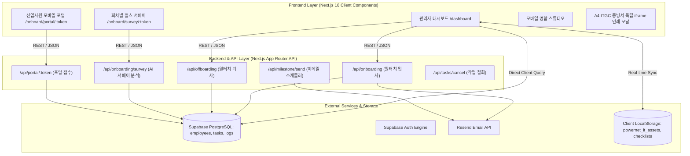
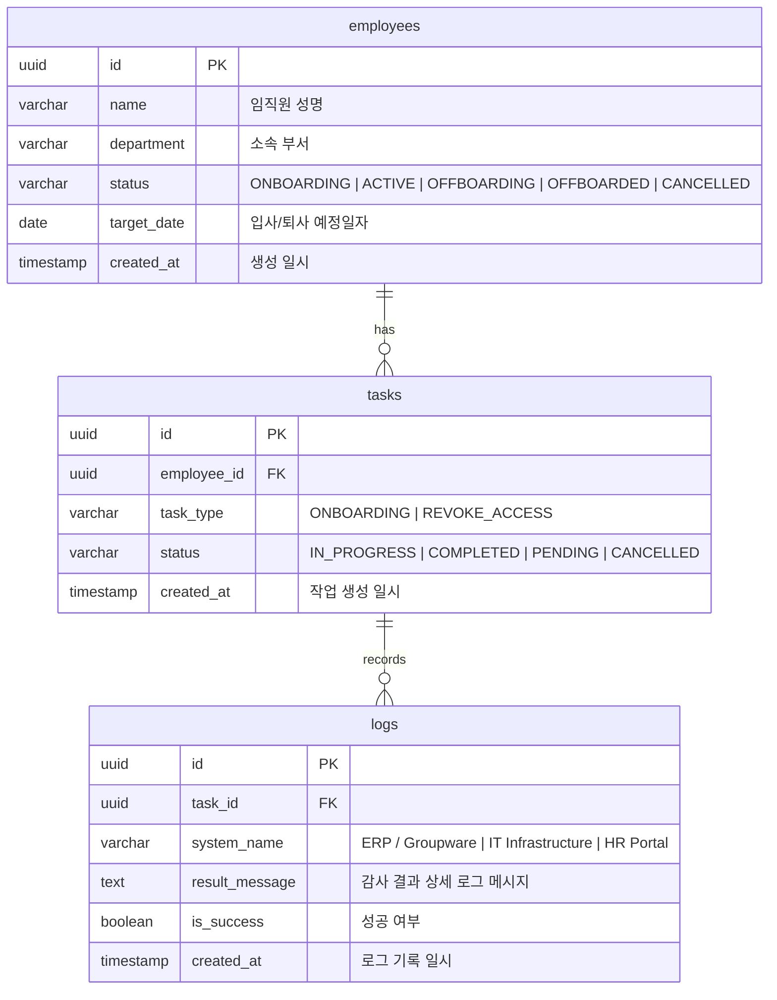

# (주)파워넷 HR Sync - 시스템 아키텍처 및 재현 설계명세서 (System Architecture & Re-Implementation Specification)

> 본 문서는 **(주)파워넷 HR Sync**의 전체 아키텍처, 데이터 모델, API 인터페이스 및 핵심 알고리즘을 기록한 공식 엔지니어링 설계명세서입니다. 본 명세서를 기반으로 동일한 엔터프라이즈 인사/계정 관리 시스템을 완벽하게 재현 및 구축할 수 있습니다.

---

## 📌 목차 (Table of Contents)
1. [시스템 개요 및 엔지니어링 목표](#1-시스템-개요-및-엔지니어링-목표)
2. [전체 시스템 아키텍처 다이어그램](#2-전체-시스템-아키텍처-다이어그램)
3. [기술 스택 및 의존성 명세](#3-기술-스택-및-의존성-명세)
4. [데이터베이스 ERD 및 스키마 명세](#4-데이터베이스-erd-및-스키마-명세)
5. [핵심 API 엔드포인트 규격서](#5-핵심-api-엔드포인트-규격서)
6. [핵심 알고리즘 및 비즈니스 로직](#6-핵심-알고리즘-및-비즈니스-로직)
7. [환경 변수 및 서드파티 서비스 설정](#7-환경-변수-및-서드파티-서비스-설정)
8. [단계별 설치, 빌드 및 배포 절차](#8-단계별-설치-빌드-및-배포-절차)

---

## 1. 시스템 개요 및 엔지니어링 목표

* **시스템 명칭**: (주)파워넷 HR Sync (엔터프라이즈 인사 및 계정 자동화 포털)
* **주요 해결 과제**:
  1. 수작업으로 분절되어 진행되던 사번 채번, 이메일 생성, 전산 장비 배정, 포털 발송, 마일스톤 등록을 1번의 클릭으로 완결하는 **원터치 5-in-1 입사 파이프라인**.
  2. 신입사원 조기 퇴사 방지를 위한 **4단계(1M, 3M, 6M, 1Y) 회차별 마이크로 펄스 서베이**와 **AI 피플 애널리틱스 조기퇴사 위험 분석(Red/Yellow/Green Flag)**.
  3. 사내 계정 즉시 차단과 대여 IT 장비(노트북, 모니터, 출입증, 고정 IP) 일괄 회수를 동시에 집행하는 **원터치 종합 퇴사 정산 엔진**.
  4. 상장사 내부회계관리제도(ITGC) 준수를 위한 **무결점 감사 로그(Audit Trail) 및 A4 공식 증빙서 인쇄/PDF 보존**.

---

## 2. 전체 시스템 아키텍처 다이어그램



---

## 3. 기술 스택 및 의존성 명세

| 구분 | 사용 기술 / 패키지 | 비고 |
| :--- | :--- | :--- |
| **Framework** | Next.js 16.3.6 (App Router / Turbopack) | 최신 React 19 아키텍처 |
| **Language** | TypeScript 5.x | 엄격한 타입 정의 (`strict: true`) |
| **Styling** | Tailwind CSS v4, Lucide React (Icons) | Apple 미니멀 라이트 디자인 시스템 |
| **Database** | Supabase (PostgreSQL 15+) | RLS 및 Admin Service Key 연동 |
| **Mailing** | Resend API SDK | 신입사원 웰컴 알림장 및 마일스톤 메일 발송 |
| **Deployment** | Vercel Serverless Edge | CI/CD Git 기반 자동 배포 |

---

## 4. 데이터베이스 ERD 및 스키마 명세

시스템은 Supabase PostgreSQL의 3대 핵심 테이블과 클라우드-로컬 하이브리드 캐시(`localStorage`)를 활용합니다.



### 4.1 IT 자산 데이터 스키마 (`powernet_it_assets`)
```typescript
interface ITAsset {
  id: string;               // ast-timestamp-seq
  empName: string;          // 사용자 성명
  department: string;       // 소속 부서
  category: 'LAPTOP' | 'DESKTOP' | 'MONITOR' | 'SECURITY_CARD' | 'NETWORK';
  modelName: string;        // 기종/모델명
  serialNumber: string;     // 시리얼 번호
  assignedDate: string;     // 지급일자 (YYYY-MM-DD)
  returnDate?: string;      // 반납일자 (YYYY-MM-DD)
  fixedIp?: string;         // 고정 IP (192.168.10.xxx)
  macAddress?: string;      // 이더넷 MAC 주소
  status: 'ACTIVE' | 'PENDING_RETURN' | 'RETURNED' | 'DISPOSED';
  notes?: string;           // 비고
}
```

---

## 5. 핵심 API 엔드포인트 규격서

### 5.1 원터치 종합 입사 API (`POST /api/onboarding`)
* **요청 (Request Body)**:
```json
{
  "name": "홍길동",
  "department": "전력변환연구소 HW개발팀",
  "rank": "선임연구원",
  "role": "HW 엔지니어",
  "location": "suwon",
  "targetDate": "2026-10-02",
  "email": "imyesir@naver.com"
}
```
* **응답 (Response Body)**:
```json
{
  "success": true,
  "employee": { "id": "uuid", "name": "홍길동", "status": "ONBOARDING" },
  "task": { "id": "uuid", "status": "COMPLETED" },
  "employeeNumber": "20264921",
  "companyEmail": "gildong.hong@gopowernet.com",
  "temporaryPassword": "PowerNet2026!#",
  "fixedIp": "192.168.10.114",
  "macAddress": "00:E0:4C:5B:3A:1F",
  "s1CardNo": "S1-KEY-89412",
  "laptopModel": "삼성 갤럭시북4 Pro 16인치 (i7/32GB/SSD 1TB)",
  "portalUrl": "/onboard/portal/uuid",
  "defaultAssets": [ /* IT 장비 3종 배열 */ ],
  "auditDocNo": "PWN-ONB-2026-A1B2C3"
}
```

### 5.2 원터치 종합 퇴사 API (`POST /api/offboarding`)
* **요청 (Request Body)**:
```json
{
  "name": "홍길동",
  "department": "전력변환연구소 HW개발팀",
  "targetDate": "2026-09-25",
  "mode": "IMMEDIATE" // 또는 "SCHEDULED"
}
```
* **응답 (Response Body)**:
```json
{
  "success": true,
  "taskId": "uuid",
  "employeeId": "uuid",
  "docNo": "PWN-OFF-2026-D4E5F6",
  "isImmediate": true
}
```

### 5.3 회차별 펄스 서베이 AI 분석 API (`POST /api/onboarding/survey`)
* **요청**: `empId`, `empName`, `stage` (1M | 3M | 6M | 1Y), `scores` (q1, q2, q3), `feedback`
* **응답**: `riskScore` (0~100), `riskLevel` (RED | YELLOW | GREEN), `flagLabel`, `riskFactors`, `actionItems`

---

## 6. 핵심 알고리즘 및 비즈니스 로직

### 6.1 한글 성명 로마자 변환 및 사내 이메일 자동 채번 알고리즘 (`src/utils/romanize.ts`)
1. 초성/중성/종성 유니코드 분해:
   $$\text{Code} = \text{CharCode} - 0xAC00$$
   $$\text{Cho} = \lfloor \text{Code} / (21 \times 28) \rfloor, \quad \text{Jung} = \lfloor (\text{Code} \pmod{21 \times 28}) / 28 \rfloor, \quad \text{Jong} = \text{Code} \pmod{28}$$
2. 성씨(Surname) 우선 매핑 테이블 적용 (예: '김' ➔ 'kim', '이' ➔ 'lee', '박' ➔ 'park')
3. 표준 이메일 조합 규칙: `[이름로마자].[성로마자]@gopowernet.com`

### 6.2 AI 조기퇴사 위험 분석(Risk Engine) 알고리즘
1. 점수 환산: 3개 5점 척도 항목 역산 가중 평균 산출
   $$\text{BaseScore} = \left(\frac{15 - \sum_{i=1}^3 Q_i}{12}\right) \times 100$$
2. 부정 감성 키워드 가중치 가산: "어려움", "퇴사", "모르겠", "부족", "답답", "힘들" 발견 시 점수 +15% 가산.
3. 3단계 Flag 판정:
   - $\text{RiskScore} \ge 65$: **`🚨 Red Flag`** (즉각 1:1 심층 면담)
   - $40 \le \text{RiskScore} < 65$: **`⚠️ Yellow Flag`** (멘토링 커피챗)
   - $\text{RiskScore} < 40$: **`✨ Green Flag`** (안정적 몰입)

### 6.3 A4 규격 독립 인쇄 프레임 격리 기법 (`DocumentPrintModal.tsx`)
브라우저 기본 `window.print()` 호출 시 대시보드 뒷배경이나 여러 페이지로 깨지는 문제를 방지하기 위해, 동적으로 `iframe`을 생성하여 대상 증빙서 페이지만 `@page { size: A4 portrait; margin: 12mm 15mm; }` 규격으로 완벽하게 격리 출력합니다.

---

## 7. 환경 변수 및 서드파티 서비스 설정

`.env.local` 파일에 아래 환경 변수를 정의합니다:

```bash
# Supabase PostgreSQL Database
NEXT_PUBLIC_SUPABASE_URL=https://your-project.supabase.co
NEXT_PUBLIC_SUPABASE_ANON_KEY=your-anon-key
SUPABASE_SERVICE_ROLE_KEY=your-service-role-key

# Resend Email Service
RESEND_API_KEY=re_your_api_key

# (선택) Upstash QStash 메시지 큐
QSTASH_TOKEN=your-qstash-token
```

---

## 8. 단계별 설치, 빌드 및 배포 절차

### 8.1 로컬 환경 구축 및 실행
```bash
# 1. 저장소 복제
git clone https://github.com/kimyeasll-byte/hr-sync.git
cd hr-sync

# 2. 의존성 패키지 설치
npm install

# 3. 개발 서버 실행 (Turbopack 초고속 번들러)
npm run dev

# 4. 브라우저 접속
# http://localhost:3000
```

### 8.2 프로덕션 빌드 검증
```bash
npm run build
```

### 8.3 Vercel 클라우드 배포
1. GitHub 저장소(`main` 브랜치)에 푸시하면 Vercel CI/CD가 자동으로 트리거되어 1분 이내에 무중단 배포됩니다.
2. Vercel Project Settings에서 환경 변수(`NEXT_PUBLIC_SUPABASE_URL`, `SUPABASE_SERVICE_ROLE_KEY`, `RESEND_API_KEY`)를 등록합니다.
