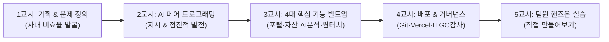

# 🎓 [팀내 교육용 교안] AI 기반 사내 업무 자동화 구축 워크숍
## : "AI 페어 프로그래밍으로 3일 만에 엔터프라이즈 인사·전산 자동화 포털(HR Sync) 구축하기"

> **교육 대상**: 사내 기획자, 인사/총무 담당자, IT/전산 담당자, 개발자  
> **교육 목표**: 
> 1. 실제 사내 업무의 비효율(온보딩, 퇴사, IT 장비, 감사)을 정의하고 AI와 협업하여 즉시 해결하는 프로덕트 빌딩 역량 습득
> 2. 프롬프트 작성부터 DB 연동, 배포, 매뉴얼 제작까지의 전 주기(End-to-End) 경험 체화  
> **교육 시간**: 총 2~3시간 (이론 30분 + 라이브 시연 30분 + 팀원 핸즈온 실습 60분)

---

## 📌 전체 커리큘럼 로드맵 (Roadmap)

---

## 1교시. [기획 & 문제 정의] "우리는 왜 이것을 만들었는가?" (20분)

### 1.1 사내 현업의 실제 페인포인트(Pain-Point) 공유
* **입사 시**: 인사팀, 총무팀, 전산팀이 각각 엑셀 파일과 메일로 따로 연락함 (사번 발급 ➔ 그룹웨어 등록 ➔ PC 세팅 ➔ 출입증 발주 ➔ 웰컴 메일 등 최소 5번 이상의 반복 수작업).
* **입사 후**: 신입사원의 1~3개월 차 조기 퇴사율 증가 (고충을 털어놓을 창구가 없고 인사팀은 퇴사 통보 후에야 원인을 알게 됨).
* **퇴사 시**: 계정 차단이 지연되어 보안 위험 발생, 지급했던 노트북·모니터·출입증 회수 누락 발생 (ITGC 회계감사 지적 사항).

### 1.2 솔루션 목표 설정 (Product Vision)
> **"단 1번의 원터치(One-Touch)로 입사와 퇴사를 완전 자동화하고, 모바일 온보딩 포털과 AI 펄스 서베이로 신입사원 안착을 돕는 엔터프라이즈 포털을 만든다."**

---

## 2교시. [AI 페어 프로그래밍 실전] "AI에게 어떻게 일 시키는가?" (30분)

팀원들에게 가장 큰 영감을 줄 수 있는 파트입니다. 코드를 몰라도 **"AI를 지휘하는 기획자/아키텍트의 관점"**을 알려줍니다.

### 2.1 AI 협업의 3대 핵심 원칙 (골든 룰)
1. **맥락(Context)을 먼저 심어줘라**:
   - ❌ 나쁜 프롬프트: "온보딩 페이지 하나 만들어줘."
   - ⭕ 좋은 프롬프트: "우리는 (주)파워넷 인사팀이야. 사내 도메인은 @gopowernet.com이고 수원/서울 사업장이 있어. 신입사원이 첫 출근 전에 스마트폰으로 준비물을 챙기고 사원증 사진을 접수하는 모바일 웹이 필요해."
2. **한 번에 다 만들지 말고 점진적으로 발전(Iterative)시켜라**:
   - 1단계: 모바일 포털 화면 ➔ 2단계: 관리자 대시보드 ➔ 3단계: AI 설문 분석 ➔ 4단계: IT 자산 대장 ➔ 5단계: 원터치 일괄 자동화
3. **실제 현업의 제약조건과 디테일을 던져라**:
   - "사원증 사진관(패밀리포토하우스) 네이버 지도 링크를 넣어줘. 사원증 제작에 2주 걸린다고 안내해줘."
   - "신입사원 설문은 최초 입사 땐 필요 없고 1개월, 3개월, 6개월, 1년 단위로 질문이 바뀌어야 해."

---

## 3교시. [핵심 기능 빌드업 스토리] "우리가 직접 구현한 5대 기능" (40분)

실제 완성된 화면을 띄워두고, 각 기능이 어떻게 설계되고 완성되었는지 설명합니다.

### 1단계: 신입사원 Day-1 모바일 셀프 온보딩 포털
* **배경**: 첫 출근 날 우왕좌왕하는 신입사원의 불안감 해소
* **주요 기능**: 출근 D-Day, 수원/서울 사업장 카카오/네이버 지도, 제휴 스튜디오 위치, 사원증 촬영 시뮬레이터, 12대 복리후생 탐색, 입사 각오 전송
* **핵심 포인트**: 전송 즉시 관리자 대시보드로 실시간 동기화되어 고화질 원본 사진 다운로드 및 에스원 발주 가능

### 2단계: 시기별 펄스 서베이 & AI 피플 애널리틱스
* **배경**: 1~3개월 차 조기 퇴사 방지
* **주요 기능**: 1M(초기적응/장비), 3M(직무R&R/협업), 6M(성장/워라밸), 1Y(비전/eNPS) 맞춤형 질문
* **AI 분석 엔진**: 점수와 주관식 텍스트를 감성 분석하여 **`🚨 Red Flag` / `⚠️ Yellow Flag` / `✨ Green Flag`** 자동 판정 및 [1:1 긴급 케어 면담] 원클릭 지원

### 3단계: IT 자산 대장 & 엑셀(CSV) 일괄 등록
* **배경**: 분실되기 쉬운 PC, 모니터, 고정 IP, S1 출입카드의 전산화
* **주요 기능**: UTF-8 BOM 지원 표준 템플릿 다운로드, 드래그앤드롭 대량 등록(Bulk Import), 실시간 자산 원장 엑셀 내보내기

### 4단계: ⚡ 대망의 "원터치 5-in-1 입사 & 퇴사 정산 파이프라인"
* **원터치 종합 입사**: 1클릭으로 사번/이메일 채번 + IT 장비 3종 배정 + 체크리스트 완료 + 웰컴 메일 발송 + ITGC 감사 로그 영구 기록
* **원터치 종합 퇴사**: 1클릭으로 계정 영구 잠금(SSO 강제 종료) + 대여 IT 자산 100% 반납(RETURNED) + S1 출입 권한 폐기 + A4 법적 퇴사 확인서 즉시 발급

### 5단계: ITGC 내부회계관리제도 감사 증빙 (A4 무결점 인쇄)
* **배경**: 상장사 회계감사 및 정보보안 실사 증빙 필요
* **주요 기능**: 브라우저 화면 깨짐 없이 A4 단 1장으로 출력되는 독립 iframe 인쇄 기술

---

## 4교시. [배포 및 운영] "아이디어를 어떻게 전사 서비스로 만드는가?" (20분)

* **GitHub & CI/CD**: 코드가 수정되면 자동으로 클라우드에 빌드되는 배포 파이프라인
* **Vercel Serverless Hosting**: 서버 설치 없이 전 세계 초고속 CDN을 통한 웹 서비스 제공
* **매뉴얼 및 명세서 체계**:
  - `MANUAL.md`: 누구나 보고 바로 쓰는 사용자/관리자 매뉴얼
  - `SPECIFICATION.md`: 기술 아키텍처와 ERD를 담아 누구나 동일 시스템을 다시 만들 수 있는 설계도
  - 대시보드 접속 즉시 뜨는 **[📖 30초 체험 팝업 모달]**

---

## 5교시. [팀원 실습 워크숍 (Hands-on)] "직접 해보는 30분 미션" (40분)

교육에 참여한 팀원들이 직접 브라우저를 열고 시스템을 조작해보는 실습 시간입니다.

### 📝 실습 시나리오 가이드
1. **[미션 1] 신규 입사자 원터치 등록 (1분)**
   - 대시보드에서 `[🚀 연구소 HW개발]` 프리셋 버튼 클릭 ➔ `[⚡ 원터치 입사 자동화 일괄 실행]` 클릭!
   - 사번, 회사 이메일, 배정 노트북, 고정 IP가 1초 만에 생성되는 과정 확인.
2. **[미션 2] 신입사원 모바일 포털 체험 (2분)**
   - 결과 카드의 `[📱 모바일 포털 바로 열기]` 클릭!
   - 사원증 사진 촬영, 복리후생 확인 후 입사 각오 입력하고 `[온보딩 준비 전송하기]` 클릭.
3. **[미션 3] 관리자 화면에서 사진 다운로드 & AI 분석 확인 (1분)**
   - `[온보딩 여정]` 서브 탭에서 방금 전송된 사원증 사진 원본 다운로드.
   - AI 피플 애널리틱스 카드의 Red/Yellow Flag 신호와 실행 권고사항 확인.
4. **[미션 4] 원터치 퇴사 처리 및 A4 증빙서 출력 (1분)**
   - `[퇴사자 권한 회수]` 탭 ➔ 대상자 선택 ➔ 보유 자산 3건 확인 ➔ `[🚨 원터치 종합 퇴사 즉시 실행]` 클릭.
   - `[🖨️ ITGC 퇴사 확인서(A4) 즉시 인쇄]`를 눌러 서명란이 포함된 공식 증빙서 확인.

---

## 💡 교육 마무리 메시지 (Takeaway)

> "우리가 한 일은 단순한 코딩이 아닙니다.  
> **'우리 회사의 번거로운 업무 프로세스를 파악하고, AI를 페어 프로그래머로 활용하여, 며칠 만에 사내 업무를 자동화하는 프로덕트를 만들어낸 것'**입니다.  
> 여러분의 업무에서도 반복되고 귀찮은 작업이 있다면, 오늘 배운 방식으로 AI와 함께 얼마든지 자동화할 수 있습니다!"
