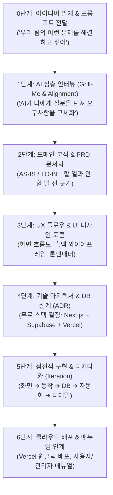

# 🚀 [비개발자를 위한 AI 웹서비스 제작 전과정 바이블]
## : "아이디어 인터뷰부터 PRD 작성, 개발, 배포까지 — 6단계 End-to-End 가이드"

> **교육의 핵심 취지**:  
> "코딩부터 무작정 시작하면 100% 산으로 갑니다.  
> 우리가 실제로 진행했던 것처럼 **(1) 아이디어 제시 ➔ (2) AI와의 심층 인터뷰 ➔ (3) PRD(요구사항 정의서) 정리 ➔ (4) UX/UI 및 아키텍처 결정 ➔ (5) 점진적 기능 빌드업 ➔ (6) 배포 및 매뉴얼화**로 이어지는 '진짜 소프트웨어 개발 생명주기(SDLC)'를 팀원들에게 교육합니다."

---

## 📌 전체 여정 조감도 (End-to-End Process Map)

---

## 0단계. [아이디어 발제] "우리의 고통스러운 문제 던지기"

팀원들에게 알려줄 첫 시작은 거창한 기획서가 아닙니다. **"우리가 현업에서 겪는 생생한 고통"**을 AI에게 털어놓는 것부터 출발합니다.

### 💬 실제 시작 프롬프트 예시:
> *"우리는 (주)파워넷 인사팀이야. 신규 입사자가 올 때마다 계정 만들고, 장비 신청하고, 메일 보내는 과정이 너무 분절되어 있어서 하루 종일 엑셀과 메일만 붙잡고 있어. 또 입사하고 1~3달 안에 퇴사하는 사람들도 많아. 이 입사와 퇴사 전과정을 원터치로 자동화하고 신입사원 케어를 돕는 웹 시스템을 구상하고 싶어."*

---

## 1단계. [AI 심층 인터뷰] "AI에게 나를 인터뷰하게 하라 (Grill-Me)"

💡 **가장 중요한 꿀팁**: 비개발자는 본인이 뭘 모르는지 모릅니다. 그래서 AI에게 **"역으로 나를 집요하게 인터뷰해서 기획의 빈틈을 파내달라"**고 명령해야 합니다.

### 💬 인터뷰 요청 프롬프트 (Golden Prompt):
> *"너는 15년 차 수석 프로덕트 매니저(PM)이자 시스템 아키텍트야. 내가 방금 말한 아이디어를 구현하기 위해 필요한 질문을 나에게 5개씩 던져줘. 기술적인 질문 말고, 현업의 업무 프로세스, 대상 사용자, 예외 상황, 회사 규칙에 대해 인터뷰해줘. 내 답변을 들은 뒤에 다음 질문을 해."*

### 📋 AI가 실제로 던진 인터뷰 질문과 답변 사례:
1. **Q. 회사의 사업장과 이메일 체계는 어떻게 되나요?**  
   ➔ A: 수원 연구소와 서울 본사 2곳이고, 도메인은 `@gopowernet.com`을 써.
2. **Q. 신입사원과 관리자의 화면은 어떻게 달라야 하나요?**  
   ➔ A: 신입사원은 첫 출근 전에 자기 폰으로 준비물과 사진을 올리는 모바일 포털이 필요하고, 관리자는 PC에서 전체 현황을 보는 대시보드가 필요해.
3. **Q. 시스템이 직접 자동화할 일과 사람이 해야 할 일의 경계는?**  
   ➔ A: 계정 생성과 이메일 발송, IP 할당은 시스템이 하고, 실물 사원증 촬영과 멘토링 면담은 사람이 직접 해.
4. **Q. 설문 조사는 언제, 어떻게 진행되나요?**  
   ➔ A: 첫날엔 설문이 필요 없고, 1개월, 3개월, 6개월, 1년에 이메일 링크로 모바일 3문항 설문을 보내서 AI가 퇴사 위험을 분석해야 해.

---

## 2단계. [도메인 분석 & PRD 수립] "문서로 선 긋기"

인터뷰가 끝나면 코드를 바로 짜지 않고, AI에게 **"지금까지 나눈 대화를 바탕으로 PRD(제품 요구사항 정의서)를 써줘"**라고 합니다. (`docs/domain/`, `docs/prd/`)

### 2.1 PRD에 반드시 들어가야 할 4가지:
1. **용어사전 (Glossary)**: 사내에서 쓰는 고유 명칭 정리 (사번, 에스원 S1, 다우오피스, ITGC 등)
2. **AS-IS vs TO-BE**: 수작업으로 하던 방식과 웹서비스로 바뀐 뒤의 모습 비교
3. **할 일(In-Scope)과 안 할 일(Out-of-Scope)의 경계**:
   - ⭕ 할 일: 계정 생성, IT 장비 배정, 설문 AI 분석, 원터치 입퇴사, A4 인쇄
   - ❌ 안 할 일: 실물 하드웨어 배송 트래킹, 급여 정산 (복잡도 통제)
4. **완료 조건 (Acceptance Criteria)**: "이 기능이 완성되었다고 판단하는 객관적 기준"

---

## 3단계. [UX 흐름도 & UI 디자인 토큰] "눈에 보이는 설계도"

화면을 그리기 전에 **"사용자가 어떤 순서로 이동하는가?"**와 **"어떤 스타일로 만들 것인가?"**를 확정합니다. (`docs/ux/`, `docs/ui/`)

1. **User Flow (사용자 동선)**:
   - 신입사원: 모바일 알림장 메일 수신 ➔ 모바일 웹 접속 ➔ D-Day/지도 확인 ➔ 사진 촬영 ➔ 각오 전송
   - 관리자: 대시보드 로그인 ➔ 원터치 입사 실행 ➔ 포털 접수 확인 ➔ 자산 대장 관리 ➔ 퇴사 차단
2. **UI 디자인 토큰 정의**:
   - "Apple 스타일의 차분한 라이트 톤 (`#F5F5F7`, 표면 `#FFFFFF`, 애플 블루 `#0071E3`)"
   - 4px 단위 그리드, 모서리 둥글기 12px~16px, Lucide 아이콘 통일
   - ➔ **이렇게 룰을 미리 정해두면 AI가 페이지를 여러 개 만들어도 디자인 일관성이 깨지지 않습니다.**

---

## 4단계. [기술 아키텍처 & DB 설계] "돈 안 드는 무료 스택 결정"

비개발자라도 **"어떤 블록들을 조립해서 집을 지을지"**를 AI와 결정합니다. (`docs/tech/`, `docs/tech/adr/`)

* **프레임워크**: Next.js 16 (App Router / Turbopack) — 최신 웹 표준, 반응형 지원
* **데이터베이스**: Supabase (PostgreSQL) — 무료로 쓸 수 있는 강력한 클라우드 DB
* **이메일 발송**: Resend API — 매달 3,000건 무료 이메일 발송
* **호스팅/배포**: Vercel — 클릭 한 번에 전 세계 배포되는 무료 서버리스 플랫폼
* **ADR (기술 의사결정 기록)**: "왜 이 기술을 골랐는가?"를 문서로 남겨 팀원들과 공유

---

## 5단계. [점진적 구현 & 핑퐁 대화] "벽돌 쌓듯이 하나씩 만들기"

기획과 설계가 끝났다면 이제 본격적으로 코드를 생성합니다. **절대로 한 번에 다 만들려고 하지 않습니다.**

### 🧱 실제 구현 순서 (5개 마일스톤):
1. **1일차 (화면 뼈대)**: 대시보드 레이아웃과 신입사원 모바일 웹 프로토타입 생성
2. **2일차 (데이터 연동)**: Supabase DB에 직원 정보 저장, 신입사원 사진 업로드 및 관리자 실시간 접수
3. **3일차 (AI 지능 탑재)**: 4단계(1M/3M/6M/1Y) 설문 페이지 및 AI 조기퇴사 위험 분석(Red Flag) 엔진 구축
4. **4일차 (사내 인프라 연계)**: IT 자산 대장, 엑셀(CSV) 일괄 등록(Bulk Import), A4 규격 독립 인쇄
5. **5일차 (완전 자동화)**: 단 1클릭으로 모든 것이 끝나는 **⚡ 원터치 5-in-1 종합 입사 & 퇴사 정산** 파이프라인 완성

---

## 6단계. [배포 & 매뉴얼화] "지속 가능한 프로덕트로 인계"

아무리 잘 만들어도 팀원들이 못 쓰면 실패입니다. 마지막은 **공유와 문서화**입니다.

1. **GitHub ➔ Vercel 연동**: 코드 푸시 30초 만에 `https://hr-sync-delta.vercel.app` 라이브 배포
2. **로그인 프리패스 설정**: 과제 심사자나 팀원이 비밀번호 없이 바로 볼 수 있도록 배려
3. **접속 즉시 매뉴얼 팝업**: 사이트에 들어오자마자 30초 핵심 체험 가이드 모달 노출
4. **공식 산출물 4종 세트 보존**:
   - `docs/MANUAL.md` (사용자/관리자 매뉴얼)
   - `docs/SPECIFICATION.md` (동일 앱 재구축 설계명세서)
   - `docs/CHANGELOG.md` (개발 이력서)
   - `docs/TRAINING_GUIDE.md` (교육 교안)

---

## 💡 팀원들에게 전할 핵심 메시지 (Key Takeaways)

1. **"코딩을 몰라도, 업무를 깊이 아는 사람이 최고의 개발 디렉터가 된다."**
2. **"시작할 땐 코드가 아니라, AI에게 나를 집요하게 인터뷰하게 만드는 프롬프트부터 던져라."**
3. **"PRD로 선을 긋고, 눈에 보이는 UI부터 만든 뒤, 무료 도구(Supabase, Vercel)로 3일 만에 세상에 내놓아라."**
