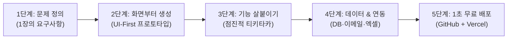

# 🚀 [비개발자를 위한 AI 웹서비스 제작 바이블]
## : "아이디어만 있으면 누구나 3일 만에 실제 웹 서비스를 만드는 5단계 범용 프레임워크"

> **교육 취지**: 인사/온보딩 시스템뿐만 아니라, **총무, 회계, 영업, 마케팅, 고객지원 등 사내의 어떤 업무라도** 비개발자 실무자가 AI를 활용해 실제 웹 서비스로 만들어내는 전 과정을 표준화한 교육 교안입니다.

---

## 📌 핵심 패러다임의 전환 (Mindset Shift)

| 과거의 사내 시스템 구축 방식 | AI 기반 현대적 웹서비스 구축 방식 (우리가 한 방식) |
| :--- | :--- |
| • 아이디어 구상 ➔ 긴 기획서 작성 ➔ IT개발팀 요청 | • **현업 실무자가 직접 AI와 1:1 페어 프로그래밍** |
| • 우선순위 밀림, 예산 부족, 외주 견적 수천만 원 | • **무료 클라우드 도구(Next.js, Supabase, Vercel) 활용** |
| • 최소 3~6개월 소요, 완성 후 현업 요구와 불일치 | • **반나절 만에 프로토타입 ➔ 2~3일 만에 실무 배포** |
| • 수정할 때마다 개발자에게 재요청 필요 | • **"이 버튼 위치 바꿔줘", "엑셀 다운로드 넣어줘"로 즉시 수정** |

> 💡 **팀원들에게 던질 핵심 메시지:**  
> **"우리는 코딩 문법을 외우는 프로그래머가 될 필요가 없습니다.  
> 우리는 문제를 가장 잘 아는 '기획자이자 디렉터(Director)'로서, AI라는 천재 개발자에게 명확한 업무 지시를 내리는 법만 알면 됩니다."**

---

## 🛠️ [5단계 표준 웹서비스 제작 프레임워크] (The 5-Step Blueprint)



---

### 1단계. [문제 정의] "엑셀과 카톡으로 하던 귀찮은 일 1개 정하기"
* **원칙**: 처음부터 거대한 시스템을 꿈꾸지 말고, **팀원들이 매일 반복하며 스트레스받는 단 1개의 수작업**을 고릅니다.
* **1장 기획 템플릿**:
  - **누가 (User)**: 사내 임직원 누구나
  - **언제 (Trigger)**: 법인차량을 예약하거나 비품을 대여할 때
  - **무엇을 (Action)**: 모바일 웹에서 캘린더를 보고 1초 만에 신청
  - **결과 (Outcome)**: 총무팀 승인 없이도 중복 예약이 방지되고 실시간 현황이 관리됨

---

### 2단계. [화면부터 생성] "UI-First로 눈에 보이는 것부터 만들기"
* **비개발자의 가장 큰 실수**: "데이터베이스는 어떻게 설계하지?", "서버는 어디에 두지?"부터 고민하다가 포기함.
* **올바른 접근법 (UI-First)**:
  - AI에게 DB나 복잡한 백엔드 얘기는 하지 말고 **"사용자가 볼 화면"**부터 그려달라고 합니다.
* **실전 프롬프트 예시**:
  > *"우리는 사내 법인차량 예약 웹을 만들 거야. Apple 스타일의 깔끔한 화이트 톤으로 만들어줘. 화면 상단에는 차량 목록(아반떼, 카니발 등)과 이용 가능 상태가 뜨고, 달력에서 날짜를 고르고 [예약하기]를 누를 수 있는 인터랙티브한 대시보드를 Next.js와 Tailwind CSS로 짜줘."*
* ➔ **결과**: 1분 만에 브라우저에서 바로 클릭해볼 수 있는 세련된 화면이 탄생합니다.

---

### 3단계. [기능 살붙이기] "AI와의 핑퐁 대화 (Iterative Ttikitaka)"
* 한 번에 완벽한 걸 요구하면 AI도 엉뚱한 코드를 짭니다. **화면 ➔ 동작 ➔ 예외 처리** 순으로 대화를 주고받습니다.
* **티키타카 대화 패턴**:
  1. *"좋아! 이제 예약 버튼을 눌렀을 때 팝업 모달이 뜨면서 탑승 인원과 목적지를 입력받게 해줘."*
  2. *"예약이 완료되면 축하 메시지와 함께 예약 번호가 뜨게 해줘."*
  3. *"관리자 모드에서는 예약된 목록을 엑셀(CSV)로 다운로드받는 버튼도 하나 추가해줘."*

---

### 4단계. [데이터 & 연동] "진짜 일하는 서비스로 진화시키기"
화면이 완성되면 AI에게 실무 필수 기능들을 하나씩 붙여달라고 요청합니다.

1. **데이터 저장 (Supabase)**: *"새로고침해도 예약 내역이 안 날아가게 무료 클라우드 DB(Supabase)에 저장되게 해줘."*
2. **이메일/알림 발송 (Resend)**: *"예약이 완료되면 신청자의 회사 메일로 예약 확인증이 자동 발송되게 해줘."*
3. **엑셀 다운로드 (UTF-8 BOM)**: *"한글이 깨지지 않는 엑셀 파일로 전체 내역을 내려받을 수 있게 해줘."*
4. **A4 서명용 인쇄**: *"외부 제출이나 결재용으로 깔끔하게 A4 1장에 인쇄되는 전용 출력 기능을 만들어줘."*

---

### 5단계. [1초 무료 배포] "링크 하나로 전사에 배포하기"
* **도구**: **GitHub (코드 보관함)** + **Vercel (무료 웹 호스팅)**
* 코드를 GitHub에 올리고 Vercel에 연결하면, **단 30초 만에 `https://my-app.vercel.app` 형태의 전 세계 접속 가능한 웹사이트**가 열립니다.
* 수정 사항이 생기면? ➔ AI와 대화 후 코드 복사해서 푸시하면 30초 만에 실시간 반영!

---

## 💡 팀원들이 내 업무에 바로 대입해볼 수 있는 사내 아이디어 5선

| 업무 분야 | 사내 현업의 고통 (Before) | AI 웹서비스로 전환 시 (After) |
| :--- | :--- | :--- |
| **총무 / 자산** | 회의실/법인차량/노트북 대여를 엑셀 장부로 관리하여 중복 발생 | **실시간 캘린더 예약 & 반납 알림 모바일 웹** |
| **법무 / 계약** | 표준 계약서의 오탈자, 필수 누락 조항을 눈으로 일일이 검토 | **계약서 파일 업로드 시 AI가 위험 조항을 3단계로 체크해주는 웹** |
| **영업 / 고객** | 매번 엑셀 서식을 열어 수작업으로 단가를 계산하고 견적서 작성 | **품목과 수량만 고르면 직인이 찍힌 PDF 견적서를 즉시 뽑아주는 웹** |
| **재무 / 회계** | 팀원들이 종이 영수증을 풀로 붙여 제출하고 담당자가 일일이 타이핑 | **영수증 사진을 찍으면 AI가 금액/가맹점을 읽어 엑셀로 뽑아주는 웹** |
| **사내 문화** | 점심 메뉴 투표, 사내 설문조사를 메신저 투표로 비효율적으로 진행 | **익명 투표 & 통계 차트가 실시간으로 시각화되는 반응형 웹** |

---

## 📋 [실전 프롬프트 스타터 팩] (팀원들에게 복사해줄 양식)

### 템플릿 1: 프로젝트 첫 시작 프롬프트
```text
나는 사내에서 사용할 [서비스 명칭: 예 - 법인차량 예약 포털]을 만들고 싶어.
- 주요 사용자: 사내 임직원 및 총무 관리자
- 핵심 기능:
  1. 이용 가능한 차량 목록 및 상태 카드
  2. 캘린더에서 날짜와 시간을 선택하여 예약 신청
  3. 관리자 대시보드에서 예약 승인 및 엑셀 다운로드
- 디자인 스타일: Apple 스타일의 미니멀하고 세련된 라이트 모드 (화이트/블루 계열)
- 기술 스택: Next.js (App Router), Tailwind CSS, Lucide React 아이콘

먼저 메인 화면 대시보드 UI를 완성도 높은 프로덕션 수준의 React 컴포넌트로 짜줘.
```

### 템플릿 2: 기능 추가 및 개선 프롬프트
```text
지금 화면에서 [A 기능]을 추가하고 싶어.
사용자가 [특정 버튼]을 클릭하면 [모달/결과/연동]이 일어나야 하고,
데이터는 [어떤 형태]로 저장/반영되어야 해.
기존 코드 스타일을 유지하면서 수정할 전체 코드를 작성해줘.
```

### 템플릿 3: 에러 발생 시 해결 프롬프트
```text
실행 중에 아래와 같은 에러 메시지가 콘솔에 떴어.
[에러 내용 붙여넣기]
원인이 무엇이고, 어떤 파일의 몇 번째 줄을 어떻게 고쳐야 하는지 단계별로 명확하게 알려줘.
```
