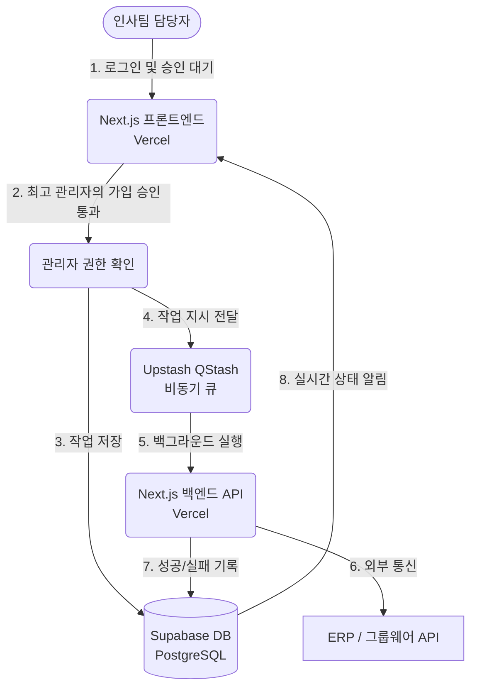

# 1. 시스템 아키텍처 (System Architecture)

## 전체 구조 설명
본 서비스는 인사/전산 담당자가 계정 생성 및 권한 회수 업무를 자동화하기 위해 사용하는 내부망 성격의 웹 서비스입니다. 
MVP 단계를 고려하여 초기 비용을 0원으로 유지할 수 있도록 최신 서버리스 스택을 조합했습니다.

- **프론트엔드/백엔드 (Next.js)**: 화면 렌더링(UI)과 백엔드 API 요청을 모두 처리하는 핵심 프레임워크입니다.
- **호스팅/배포 (Vercel)**: Next.js 앱을 올려서 24시간 돌아가게 해주는 무료 호스팅 서비스입니다.
- **데이터베이스 (Supabase)**: 무료 PostgreSQL 데이터베이스이며, 관리자 승인 여부 통제 및 실시간 알림을 담당합니다.
- **비동기 큐 (Upstash QStash)**: 최대 1~2분이 걸리는 계정 세팅 작업을 백그라운드에서 안전하게 처리해 주는 큐(Queue) 서비스입니다.

## 작동 순서
1. 담당자가 `@gopowernet.com` 이메일로 최초 로그인 시 '승인 대기' 화면에 갇힙니다.
2. 기획자(최고 관리자)가 이메일을 확인하고 가입을 승인(Approve)해야만 진짜 업무 화면이 열립니다.
3. 승인된 담당자가 신규 입사자/퇴사자 정보를 입력하고 [완료 처리] 버튼을 누릅니다.
4. Next.js 서버가 이 내용을 받아 Supabase DB의 `tasks` 테이블에 저장합니다.
5. 동시에 Upstash QStash로 지시를 던지고 화면은 즉시 풀립니다.
6. 백그라운드에서 시스템이 그룹웨어/ERP 서버를 찔러 계정을 세팅합니다.
7. 완료/에러 발생 시 DB의 `logs` 테이블에 결과를 적고, 담당자 화면 알림 패널에 핑을 띄웁니다.

## 아키텍처 다이어그램 (Mermaid)

