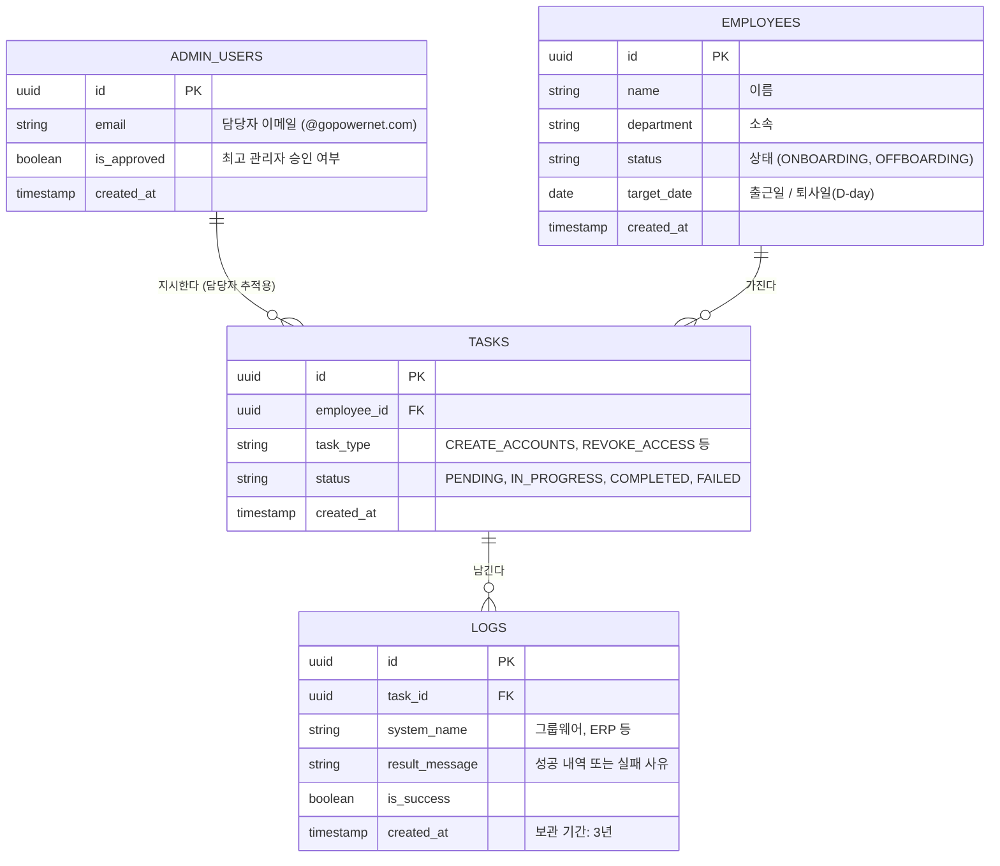

# 2. 데이터베이스 구조 (ERD)

## ERD (Mermaid)

## 도메인 문서 매핑
- **ADMIN_USERS (담당자)**: 시스템에 접속하는 인사/전산팀 4명의 계정. 관리자의 승인(`is_approved = true`)이 없으면 업무 화면 접근이 차단됨.
- **EMPLOYEES (직원)**: 신규 입사자와 퇴사자의 기본 정보.
- **TASKS (작업 덩어리)**: 계정 생성, 권한 회수 등의 백그라운드 작업 단위. 
- **LOGS (성공/실패 기록)**: 알림 패널에 띄울 성공/에러 메시지 및 내부 감사(ITGC)용 3년 보관 데이터.
