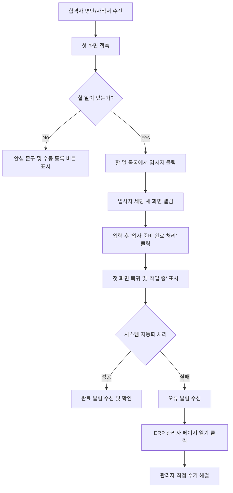

# 1. 사용자 흐름도 (User Flow)

## 흐름 설명
1. **진입 계기**: 담당자는 합격자 명단을 받거나 결재된 사직서를 받았을 때 시스템에 접속한다.
2. **첫 화면 (대시보드)**: 달력과 할 일 목록 중 선호하는 뷰를 선택하여 오늘 해야 할 일과 이번 달 일정을 한눈에 파악한다. (비어있을 경우 안심 문구와 함께 수동 등록 버튼이 보임)
3. **입사자 세팅 진입**: 할 일 목록에서 '신규 입사자 입사 준비' 항목을 클릭하면, 입사자 세팅을 위한 꽉 찬 '새 화면'으로 이동한다.
4. **세팅 정보 입력 및 완료**: 담당자가 입사자 정보와 필수 프로그램을 선택하고 화면 끝에 있는 [입사 준비 완료 처리] 버튼을 누른다.
5. **기다림 및 다중 작업**: 화면은 즉시 '첫 화면'으로 돌아가며, 해당 입사자 항목 옆에 '작업 중(30%)' 진행 상태가 표시된다. 담당자는 화면에 갇히지 않고 다른 업무를 계속할 수 있다.
6. **완료 또는 오류 알림**: 작업이 끝나면 완료 알림이 뜬다. 만약 실패(예: ERP 계정 생성 실패)하면 오류 알림 패널이 뜬다.
7. **오류 해결 (선택)**: 오류 알림에서 [ERP 관리자 페이지 열기] 버튼을 눌러 직접 해당 시스템 관리자 페이지로 이동하여 수기로 문제를 해결한다.

## 흐름도 (Mermaid)

